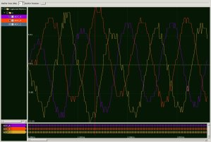

Analogue to Digital Conversion (ADC) Simulator Test-bench
=========================================================

.. _test_adc_Quickstart:

This application is an xSIM test harness for the analogue-to-digital converter component using xTIMEcomposer Studio. It tests the ADC functions in the ``Analogue to Digital Conversion (ADC) Component`` xSOFTip component and directs test results to STDOUT.

No hardware is required to run the test harness.

Import and Build the Application
--------------------------------

   1. Open xTIMEcomposer and check that it is operating in on-line mode. Open the edit perspective (Window->Open Perspective->XMOS Edit).
   #. Locate the ``Analogue-to-Digital Converter Test Harness`` item in the xSOFTip pane on the bottom left of the window and drag it into the Project Explorer window in the xTIMEcomposer. This will also cause the modules on which this application depends to be imported as well. These modules are: ``module_foc_adc``, and ``module_locks``.
   #. Click on the app_test_adc item in the Explorer pane then click on the build icon (hammer) in xTIMEcomposer. 
   #. Check the console window to verify that the application has built successfully. 

For help in using xTIMEcomposer, try the xTIMEcomposer tutorial, that can be found by selecting Help->Tutorials from the xTIMEcomposer menu.

Note that the Developer Column in the xTIMEcomposer on the right hand side of your screen provides information on the xSOFTip components you are using. 
Select the ``module_foc_adc`` component in the Project Explorer, and you will see its description together with API documentation. 
Having done this, click the ``back`` icon until you return to this quickstart guide within the Developer Column.

Configure And Run The Simulator
-------------------------------

   #. Double click ``app_test_adc`` in the left hand ``Project Explorer`` window.
   #. Click on the arrow next to the ``Run`` icon (the white arrow in the green circle) in the top menu bar. Select ``Run Configurations``
   #. In ``Run Configurations`` window, double click on ``xCORE Application``.
   #. You should find that the left hand side of the ``Run Configurations`` window, should be populated with details from the ``app_test_adc`` project. If the details are blank, this is probably because the project was not selected correctly in the first step. If this has happened, and the problem persists, browse to the correct project, and select the executable.
   #. Select the ``run on simulator`` button.
   #. Now setup the loopbacks between the stimulus generator and the ADC component.

      #. Select the ``Simulator`` tab.
      #. Select the ``Loopback`` tab.
      #. Click ``Enable pin connections``.
      #. Click ``Add`` and dialogue boxes will appear for Tile, Port, Offset and Width. These should be filled in with the following information and steps shown in the table below. The second time the simulator is run, it is only necessary to click on the ``Run`` icon (the white arrow in the green circle) in the top menu.

                +-------+--------+------------+-------+------+
                | From: |    1   | XS1_PORT_1G|   0   |   1  |
                +-------+--------+------------+-------+------+
                | To:   |    1   | XS1_PORT_1C|   0   |   1  |
                +-------+--------+------------+-------+------+

      #. Click ``Add`` again and then do the below

                +-------+--------+------------+-------+------+
                | From: |    1   | XS1_PORT_1H|   0   |   1  |
                +-------+--------+------------+-------+------+
                | To:   |    1   | XS1_PORT_1D|   0   |   1  |
                +-------+--------+------------+-------+------+

      #. Click ``Add`` again and then do the below

                +-------+--------+------------+-------+------+
                | From: |    1   | XS1_PORT_1I|   0   |   1  |
                +-------+--------+------------+-------+------+
                | To:   |    1   | XS1_PORT_1E|   0   |   1  |
                +-------+--------+------------+-------+------+

      #. Click ``Add`` again and then do the below

                +-------+--------+------------+-------+------+
                | From: |    1   | XS1_PORT_1J|   0   |   1  |
                +-------+--------+------------+-------+------+
                | To:   |    1   | XS1_PORT_1F|   0   |   1  |
                +-------+--------+------------+-------+------+

      #. Click ``Apply``
      #. Click ``Run``

Test Results 
------------

After a few seconds, output will start to appear in the console window. A dot is printed every time a ADC Client request is made. This gives confidence that the test harness is doing something! The default test lasts about 1 minute. It should complete with the message "ALL TESTS PASSED". If any tests fail, extra output will be generated giving details on the test(s) that failed.

An example of the default test output from a working ADC component can be found in a file named ``adc_min_results.txt``

Using The ``Value Change Dump`` (VCD) File
------------------------------------------

The waveforms on the output pins can be inspected by using a VCD file. This requires a lot of memory and considerably slows down the simulator. First ensure enough memory has been requested in the xTIMEcomposer init file. Go to the root directory where the XMOS tools are installed. Then edit file ``xtimecomposer_bin/xtimecomposer.exe.ini`` and ensure the requested memory is at least 4 GBytes (``-Xmx4096m``)

Now launch xTIMEcomposer and switch on VCD tracing as follows ...

   #. Repeat the actions described above up to but NOT including ...
   #. Click ``Apply``
   #. Now select the ``Signal Tracing`` tab.
   #. Tick the ``Enable Signal Tracing`` box
   #. Click the ``Add`` button
   #. Select ``tile[1]``
   #. Tick the ``+details`` box
   #. Click ``Apply``
   #. Click ``Run``

VCD Test Results 
................

On long runs, you may want to kill the simulations before testing has finished. This can be done by clicking on the red square button in the view-bar for the console window. 

When the executable has stopped running, view the VCD file as follows:-

   #. In the main toolbar select Tools->Waveform_Analyzer->Load_VCD_File
   #. Browse to the application root directory or where the VCD file was created.
   #. Select the VCD file and click the ``OK`` button.
   #. The VCD file will start loading, this may take some time, 
   #. WARNING If an ``out-of-memory`` error occurs, increase the xTIMEcomposer memory (described above) to be larger than the VCD file.
   #. When the VCD file has loaded correctly, a list of ports should appear in the ``Signals`` window.
   #. If not already active, open a ``Waveform`` window as follows:-
   #. In the main toolbar, select Window->Show_View->Waves
   #. Now add some signals to the Waves window as follows:-
   #. In the Signals window, select tile[1]->ports->XS1_PORT_1J, and drag this to the left-hand column of the Waveform window
   #. This may not work first time, but try leaving a few seconds between selecting and dragging
   #. When successful a set of 12 waveforms should appear in the right column of the Waveform window. These are for ADC Serial clock. The top trace (PORT_ADC_CLK) should have a period of 140ns (about 7.142 MHz).
   #. Repeat the above process for tile[1]->ports->XS1_PORT_1G, This is the ready signal. The top trace (PORT_ADC_CONV) goes high during ADC sample conversion. This should occur on average about every 8 us (When run in 'Non-Paced' mode). 
   #. Repeat the above process for tile[1]->ports->XS1_PORT_1H, This is the data port for Phase_A. The 5th trace down (shiftReg[32]) shows the data being clocked out. 14 bits while the ready signal is high.
   #. Note well, to view all the trace click the ``Zoom Fit`` icon (House) at the right of the Waveform window view-bar. To zoom in/out click the 'plus/minus' icons to the left of the ``Zoom Fit`` icon.

.. figure:: vcd_adc.jpg
   :width: 100%
   :align: center
   :alt: Example VCD Waveform

   VCD Waveform

Using The ``xSCOPE`` (xmt) File
-------------------------------

The values of variables in the program can be inspected using the xSCOPE functionality. This allows time-varying changes in variable values to be plotted in a similar manner to using an oscilloscope for real-signals. 

Now rebuild the code as follows:-

   #. In the ``Run Configurations`` dialogue box (see above), select the xSCOPE tab
   #. Now select the ``Offline`` button, then click ``Apply``, then click ``Run``

The program will build and start to produce test output in the Console window. When the test has completed, move to the Project explorer window. In the app_test_adc directory there should be a file called ``xscope.xmt``. Double click on this file, and the xSCOPE viewer should launch. On the left-hand side of the viewer, under ``Captured Metrics``, select the arrow next to ``n``. A sub menu will open with 3 signals listed: ADC_A, ADC_B, and ADC_C. Use the boxes to the left of each signal to switch the trace on and off. Note the following features:-

   #. The traces have a transient at the start (left), which quickly decays to a steady-state by the end of the test (right).
   #. The traces for all 3 phases start at zero, therefore the DC bias is non-zero, as time progresses, each trace drifts towards a DC bias of zero.
   #. The traces are separated in phase by 120 degrees.
   #. When the traces have settled, the peak-to-peak amplitude of each phase is about 16, which is correct for the 'Small Gain' option used in this test.

Note well, to view all the trace click the ``Zoom Fit`` icon (House) at the right of the Waveform window view-bar. To zoom in/out click the 'plus/minus' icons to the left of the ``Zoom Fit`` icon

   xSCOPE Trace

To learn more about xSCOPE look at the ``How To`` by selecting ``Window --> Show_View --> How_To_Browser``. Then in the search box type ``xscope``. This should find the section titled ``XMOS Examples: Instrumentation and xSCOPE``. In the sub-section ``Event Examples`` you will find more information on capturing events. In the sub-section ``IO Examples`` you will find more information on re-directing I/O using xSCOPE.
